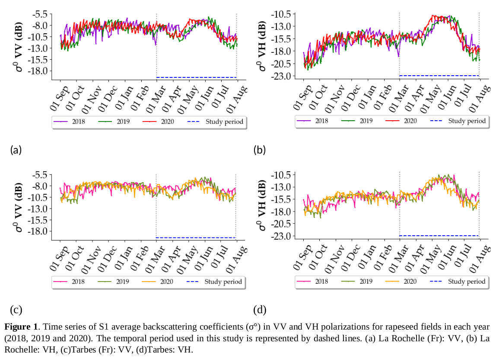

# Sentinel1 Peak Alignement
This is the code for the time series alignment method which applied in our paper: 

> S. Maleki et al. "*Sentinel-1 (S1) Time Series Alignment Method for Rapeseed Fields Mapping*", under review at Frontiers in Remote Sensing journal, 2024. 

In fact, the position of the highest peak in the Sentinel1 time series across the rapeseed growth cycle differs between two years or between two study sites as shown in Figure1, which may likely induce lower accuracies when transferring a classifier from one site-year to another. The alignment of the highest peaks in the S1 time series of the training and test datasets was achieved through a process consisting of three steps outlined in our paper. 

To apply the alignment method:

1. Prepare the S1 dataset in VV and VH polarizations in NPZ format. The dataset should include:
    - VV and VH polarizations as `X_SAR`
    - The ID of each field as `id_parcels`
    - The crop types as `y`
    - The dates as `dates_SAR`
2. Use the code `Step1_Peak_Detection.py` to identify the dataset on which the alignment method should be applied.
3. Next, use the code `Step2_Peak_Alignement.py` to perform the alignment.

For the code associated to the classification task, please refer to the following repository: [Colza_Classif](https://github.com/cassiofragadantas/Colza_Classif)

